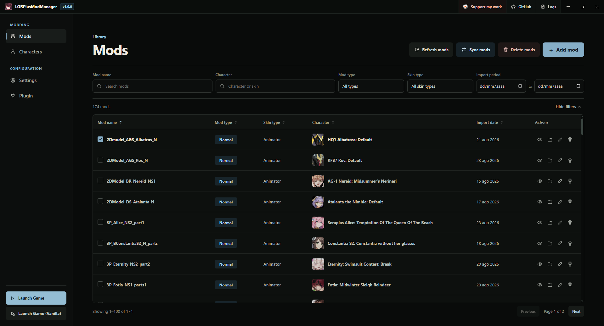
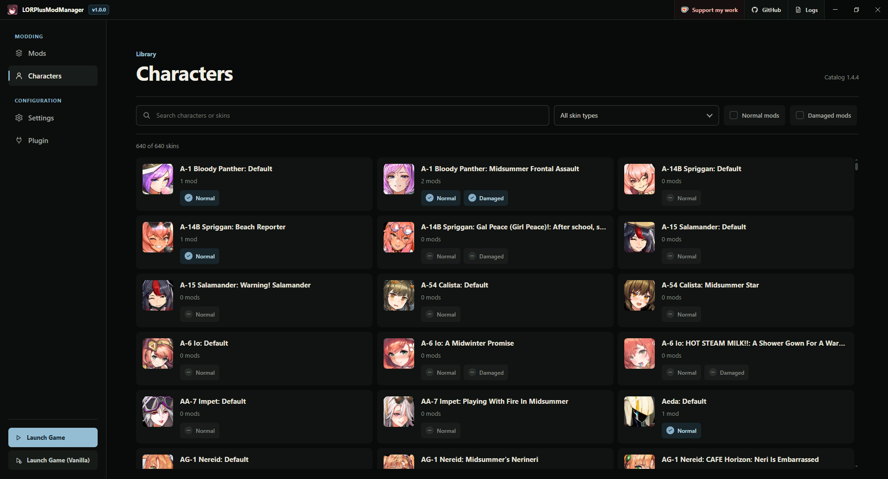
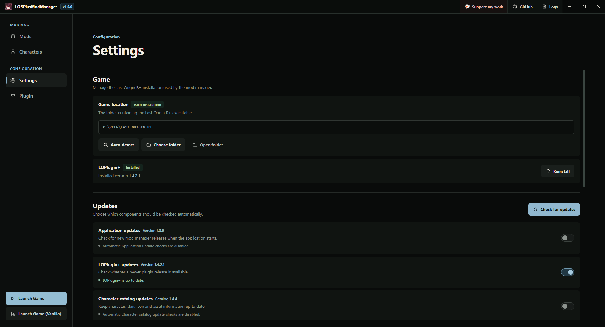
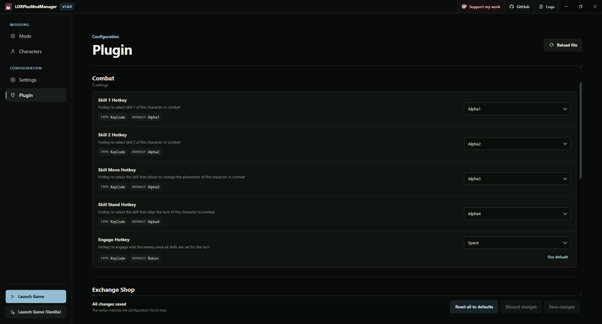
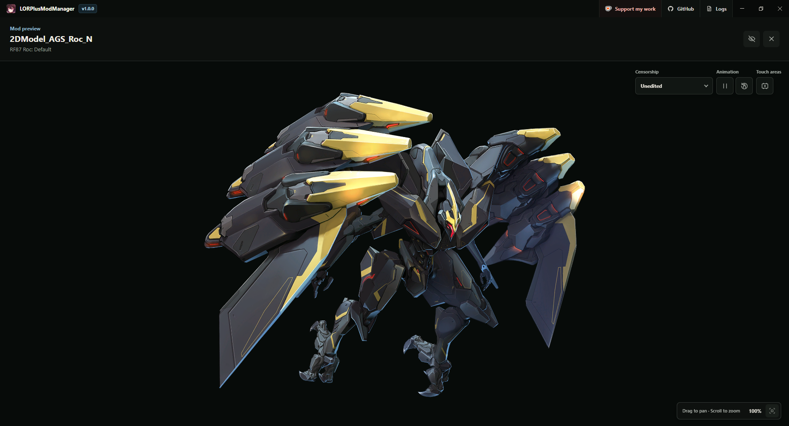

  

<h1 align="center">LORPlusModManager</h1>

  
  
  
  
  
  

> A Windows mod manager for Last Origin R+.

LORPlusModManager installs the required game integration, imports and organizes character mods, synchronizes selected mods with the game, and provides interactive previews for supported skins.

## 🚀 Features

- Automatic Last Origin R+ location detection.
- Automatic BepInEx and LOPlugin+ installation and updates.
- Single-file and batch mod imports.
- ZIP and Unity asset bundle support.
- Password-protected ZIP support.
- Automatic character and skin matching.
- Static, Spine, and Animator mod previews.
- Character catalog with mod counts and filtering.
- Mod conflict and missing-file detection.
- Copy and symbolic-link synchronization.
- LOPlugin+ configuration editor.
- Application, plugin, and character catalog updates.
- Integrated logs and storage maintenance.
- Modded and vanilla game launch options.

## 📋 Requirements

- Windows 10/11, 64-bit.
- Last Origin R+ (Obviously).
- [LOLauncher 1.0.5 or later](https://github.com/Jelosus2/LOLauncher/releases) to use the built-in game launch buttons.

**Note:** LOLauncher is optional if you start the game separately.

## 📦 Installation

1. Download and install the latest installer from the [Releases](https://github.com/Jelosus2/LORPlusModManager/releases) page.
3. Select or automatically detect your Last Origin R+ installation.
4. Allow the setup process to install BepInEx and LOPlugin+.
5. Import mods and select the ones you want to synchronize.

## 📥 Importing mods

LORPlusModManager accepts:

- ZIP archives (can contain Unity asset bundles inside the ZIP).
- Unity asset bundles.
- Multiple files in a single batch.

ZIP archives are limited to:

- 20,000 entries.
- 1 GB per individual entry.
- 2 GB total extracted content.

Imported mods are stored in the application data directory. They are only placed in the game directory after synchronization.

## 🔄 Synchronization methods

### 📁 Copy

Copies selected mod files into the game directory.

- Does not require administrator privileges.
- Uses additional disk space.
- Works well with other file-management tools.

### 🔗 Symbolic link

Links the game directory to the imported mod library.

- Uses little additional disk space.
- Synchronizes large libraries faster.
- Requires administrator privileges.
- Depends on the original imported mod files remaining available.

## ❓ All cool, but, where do I get mods?

You can find mods in the [Last Origin Modding Center](https://discord.gg/8bdGg9rz6r) discord server.

## 📷 Screenshots

### Mods Screen

### Characters Screen

### Settings Screen

### Plugin Configuration Screen

### Mod Preview Screen

## ❤️ Support

If you find the mod manager useful and want to support the development, you can do so here:

- KoFi: https://ko-fi.com/jelosus1

## ⚠️ Disclaimer

LORPlusModManager is an independent, unofficial project.

This project is not affiliated with, endorsed by, sponsored by, or approved by Valofe or any related company. Last Origin R+, VFUN, and related names, logos, and assets are property of their respective owners.